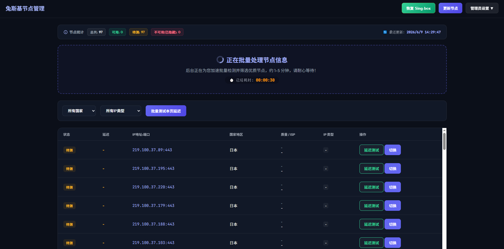

# TuzkiVpnGate
TuzkiVpnGate是一个借助vpngate.net让Linux用干净ip出站的代理工具。 

VPNGATE 地址：https://www.vpngate.net/ja/

上游仓库地址：https://github.com/baoweise-bot/aimili-vpngate 

本仓库fork后自定义修改了大部分代码： 

1.支持ip断线后从备选池切换ip。 

2.支持singbox脚本运行的vps环境（singbox的配置路径务必确保是：/etc/sing-box，文件名称 config.json。 

3.支持绑定域名。 

4.支持登录失败5次，锁定IP和用户名，锁定后可以通过重启服务刷新。 

5.其余细节优化。 

6.使用方法：下载代码后，在vps上新建一个目录，然后将文件拖进去，cd 到对应目录，之后 bash install.sh 即可！ 

======================以上所有修改均来自于谷歌的 “Gemini”  ======================

